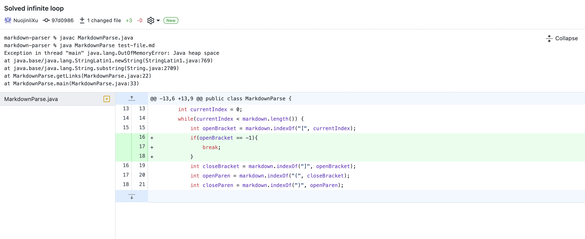
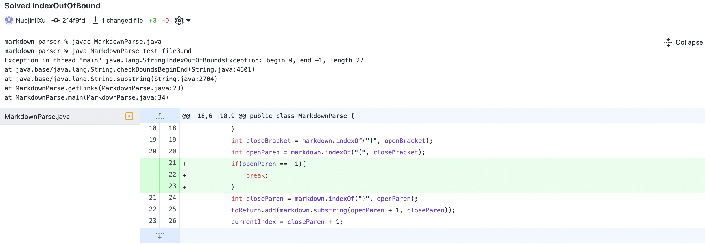
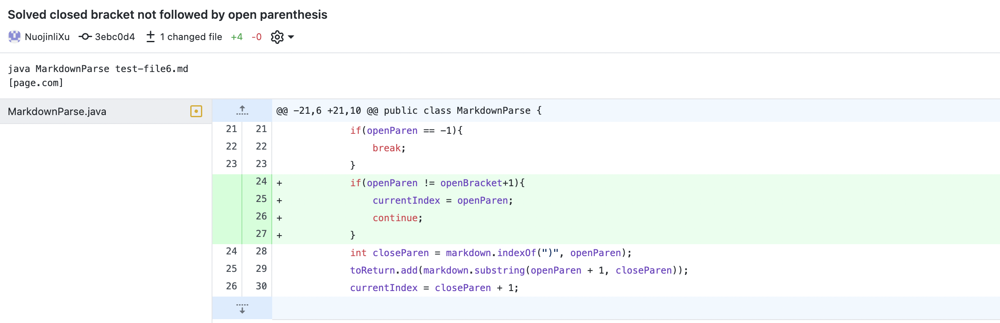

# Lab Report2

## First change

[test-file1](test-file.md)

`% javac MarkdownParse.java
% java MarkdownParse test-file.md
    Exception in thread "main" java.lang.OutOfMemoryError: Java heap space
    at java.base/java.lang.StringLatin1.newString(StringLatin1.java:769)
    at java.base/java.lang.String.substring(String.java:2709)
    at MarkdownParse.getLinks(MarkdownParse.java:22)
    at MarkdownParse.main(MarkdownParse.java:33
    `

Explanation: Because there is an extra line after the last close parenthesis, the length of markdown will be greater than currentIndex, leading to an infinite loop.
The bug is that it does not check the extra space after close parenthesis, so I fix it by checking the index of the open bracket. If no open bracket is found after the currentIndex(index = -1), then it should break the loop. 

## Second change

[test-file3](test-file3.md)

`
% javac MarkdownParse.java
% java MarkdownParse test-file3.md
Exception in thread "main" java.lang.StringIndexOutOfBoundsException: begin 0, end -1, length 27
at java.base/java.lang.String.checkBoundsBeginEnd(String.java:4601)
at java.base/java.lang.String.substring(String.java:2704)
at MarkdownParse.getLinks(MarkdownParse.java:23)
at MarkdownParse.main(MarkdownParse.java:34)
`

Explanation: There might not be an open parenthesis after the close bracket, but the code will still search for the open parenthesis, leading to openParen = -1 and the code ended up in an StringIndexOutOfBoundException. Thus, we need to check if a open Parenthesis is found after the close bracket and break the loop if none was found.

## Third change

[test-file6](test-file6.md)

`java MarkdownParse test-file6.md `

`[page.com]`

Explanation: A link only work when the open parenthesis follows immediately after the close bracket.Thus, the bug did not check for this will cause printing the content after the open parenthesis when there it is not actually a valid link in markdown grammar. The solution is to check that if the open parenthsis's index is one after the index of the close bracket. The loop should continue and search for the next open bracket.

