# Lab Report 4
[link to my markdownparser](https://github.com/NuojinliXu/markdown-parser)

[link to the code I reviewed](https://github.com/NLChung9/markdown-parser)

First test
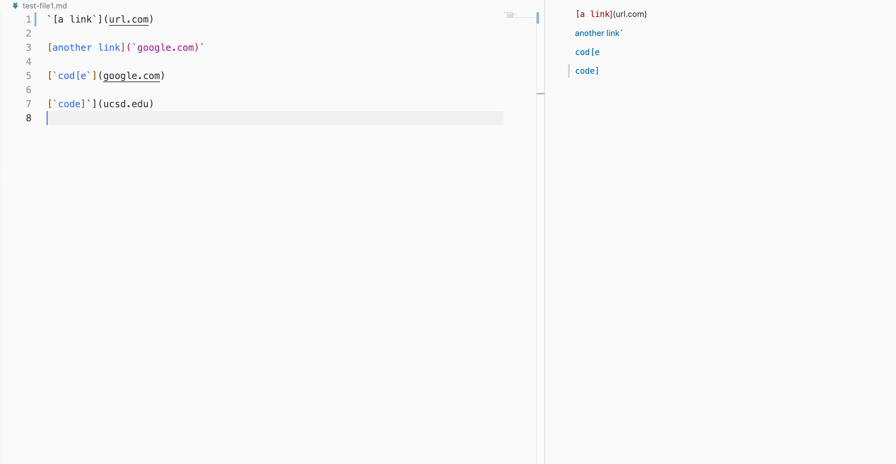
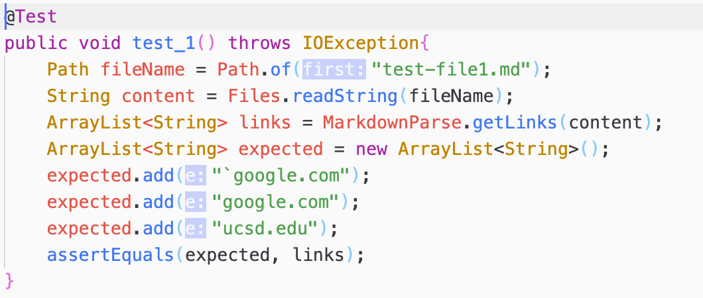
Second test
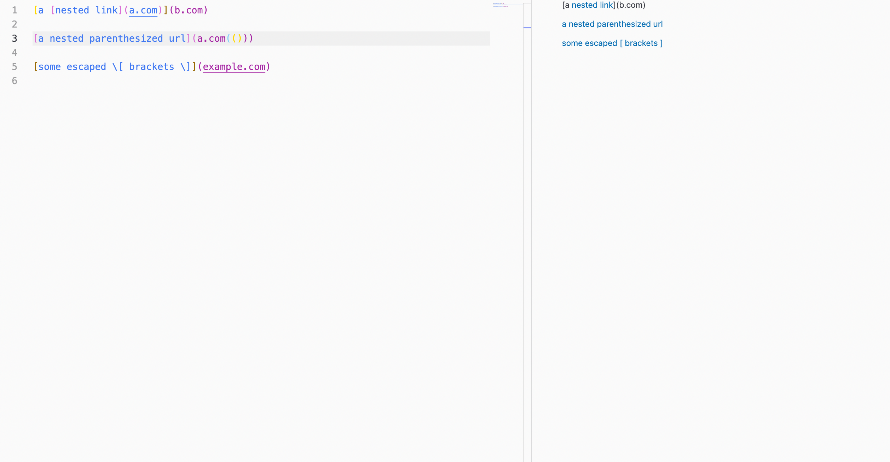
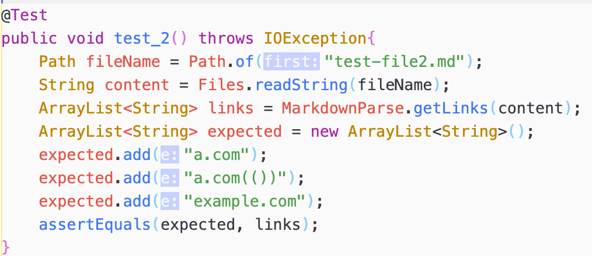
Third test
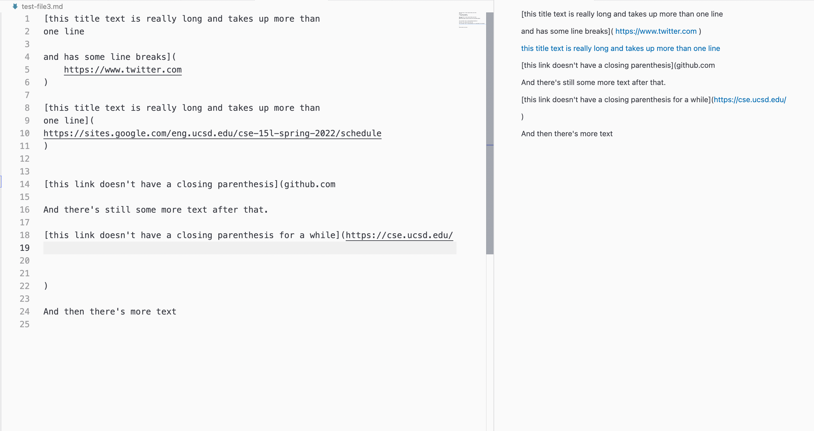
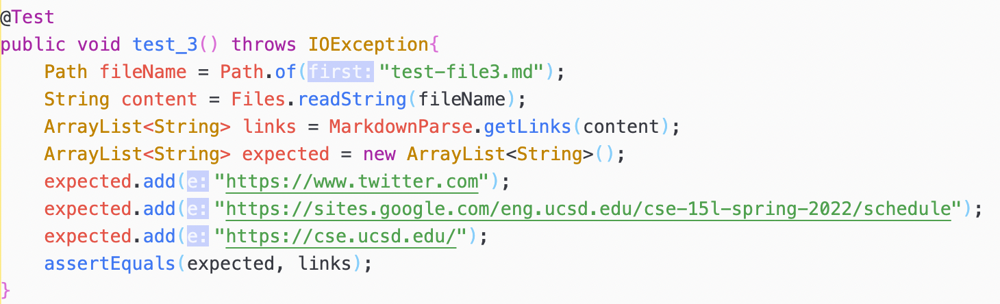

Test results on my code

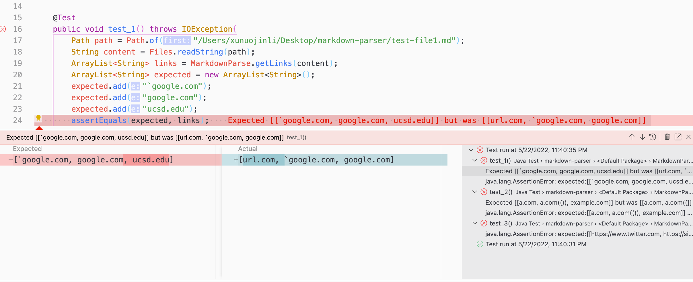
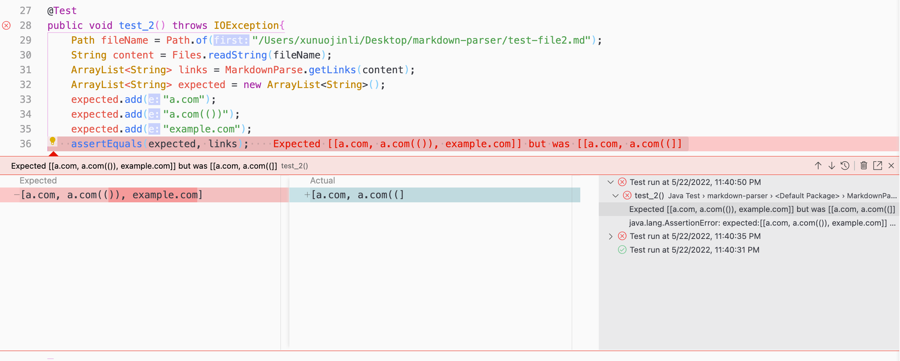
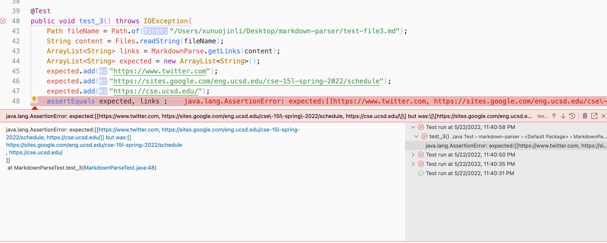

Test results on the code I reviewed
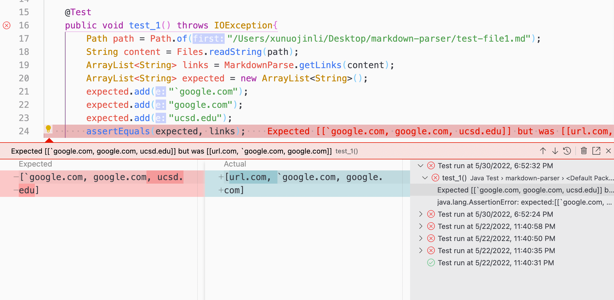
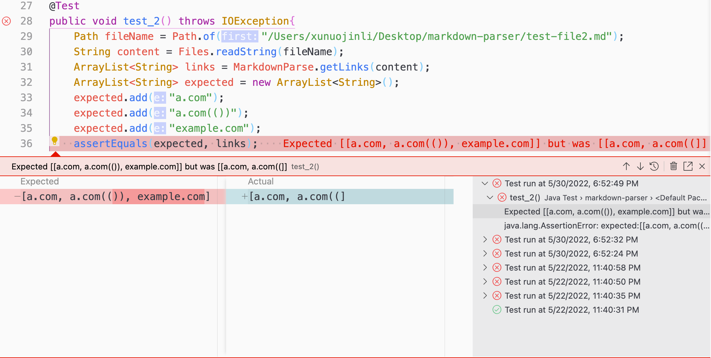
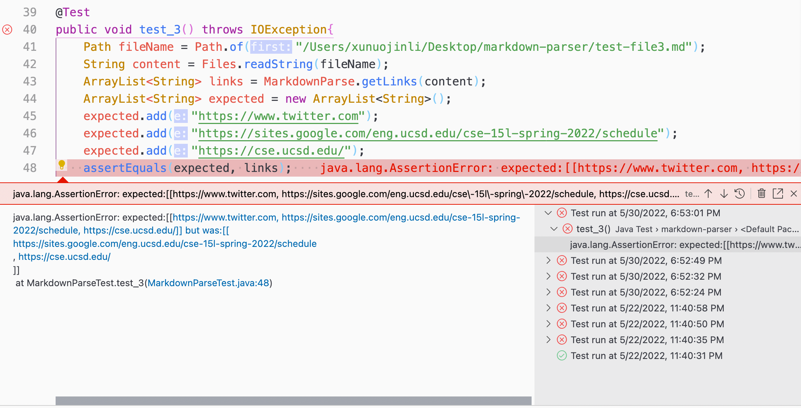
## Questions
1. Yes, I added the following changes
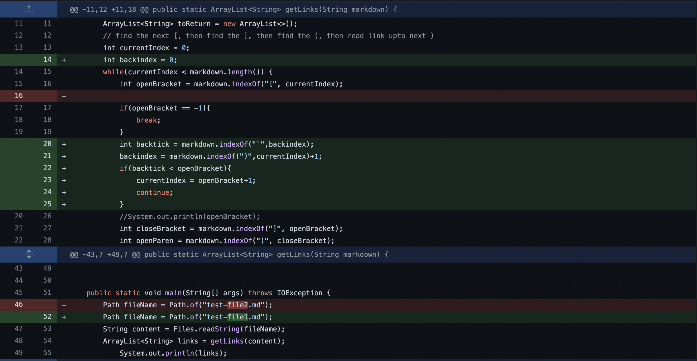

2. Yes, I added the following changes

3. No, keep tracking of number of \n in the link need more than 10 lines of code

