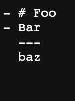
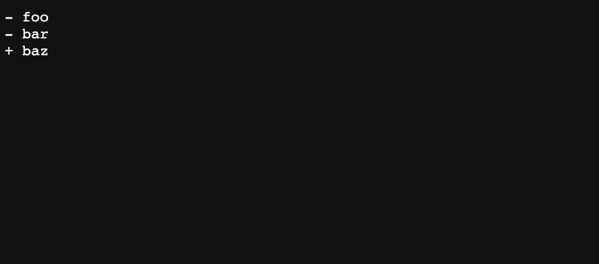
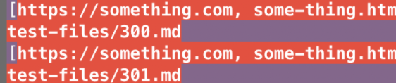
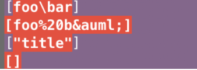

# Lab Report 5
I used `vim diff` command to show the results and test files and manually scroll through the window to find test file with different results

[first test file](https://github.com/nidhidhamnani/markdown-parser/blob/main/test-files/300.md)

[second test file](https://github.com/nidhidhamnani/markdown-parser/blob/main/test-files/301.md)

Both implementation has the wrong output.
The expected output should be `[]` since there's no link in the markdown file.
My result:

Provided result:

