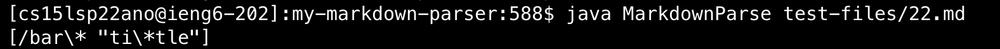

# Lab Report 5
I used `vim diff` command to show the results and test files and manually scroll through the window to find test file with different results

First difference

[First test file](https://github.com/nidhidhamnani/markdown-parser/blob/main/test-files/22.md)

My output:

Provided code output:

By CommonMark demosite, it should interprete the characters in the parathesis as a link. 

By putting the cursor on the link we can see the expected output is `[bar*]`

So neither code produces the correct output

The bug in the provided code failed to add the link to the Arraylist.The code probably caused the bug is show below

On line 75 the if statement checks for no space and newline characters in the link, but in the linked provided in the testfile, there exists a space. Therefore, the code goes to the else segment and does not add the link to the Arraylist when it should.

The second difference is show below 

[Second test file](https://github.com/nidhidhamnani/markdown-parser/blob/main/test-files/32.md)

My output:

Provided code output:

By CommonMark demosite, it should the line as a link 

And by putting the cursor on it, we can see the expected output is `[föö]`

Thus neither code produces the correct output

The bug in my code is I did not take into consideration about the case with a link title in the parathesis. 

In line 35, I directly added everything between the openparenthesis and the close paraenthesis into the Arraylist. This caused the link title being interpreted as part of the link thus produces incorrect output.